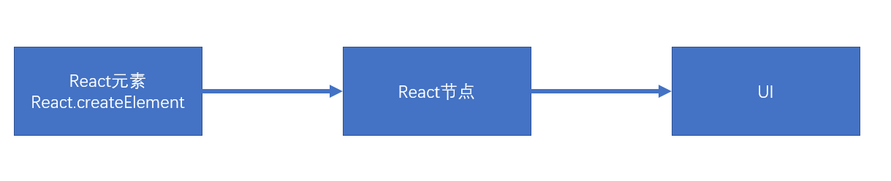
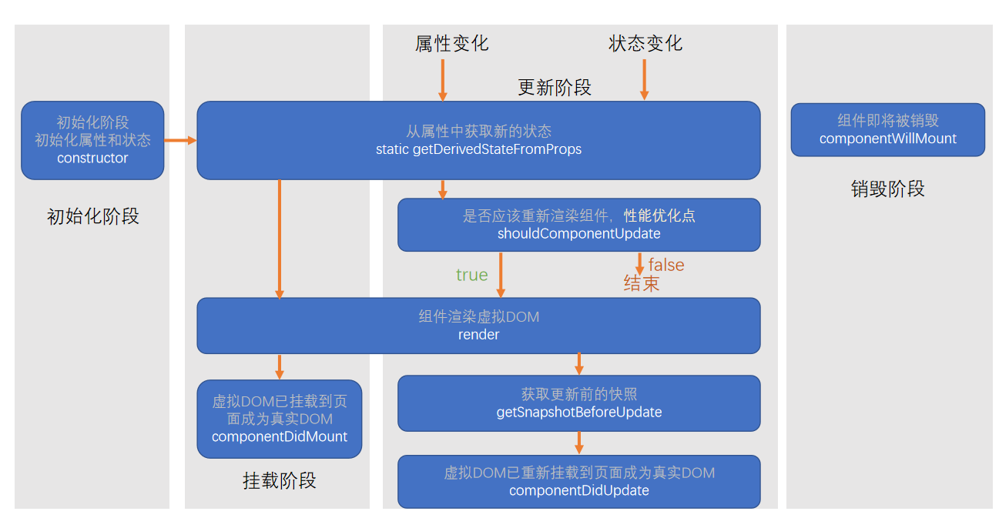
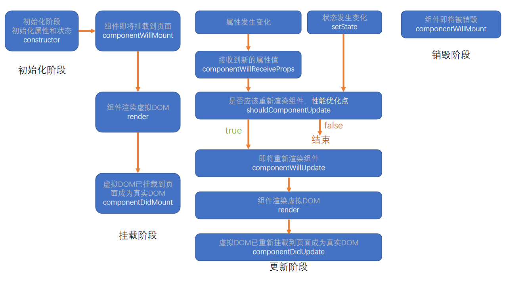

# react { ignore }

一个用于构建用户界面的 js 库

## JSX 简介

JSX 是 js 的语法扩展，可以让你在 js 中书写 XML 代码

### 使用 JSX

将一个 JSX 表达式赋值给一个变量

```js
const element = <h1>Hello, world!</h1>;
```

#### 在 JSX 中使用 JS 表达式

```js
// 在JSX表达式中的{}内可以写js表达式
// 如果我想写{}怎么办？可以写在字符串里哦{'{}'}
const name = "Josh Perez";
const element = <h1>Hello, {name}</h1>;
```

#### 在 JSX 中使用属性

```js
// 注意在JSX语法中，属性名为小驼峰命名
// 例如：在JSX中class变成了className，tabindex变成了tabIndex
const el1 = <div tabIndex="0"></div>;
// 属性值也可以使用js表达式哦
// 那属性名呢？可以是js表达式吗？你可以试试。
const el2 = </img>;
// 属性可以是一个展开的对象，对象的key会成为属性名，对象的value会成为对应属性名的属性值
const props = {
  foo: "foo",
  bar: "bar",
  baz: "baz",
};
const el3 = <div {...props}></div>;
```

### 元素（react 元素）

元素是构成 React 应用的最小单位
元素描绘了你在屏幕上想看到的内容
元素是通过 React.createElement 函数创建的**对象**
react DOM 会负责更新 DOM 与 React 元素保持一致

##### react 哲学：

react 元素是不可变对象：一旦创建你就无法更改它的子元素或者属性。
react 认为每一个元素从它被创建的那一刻就应该是确定的唯一的，它代表了某个时刻的 UI，不应随着时间改变而改变。如果你想要更新 UI 界面，你应该创建一个全新的元素，并将其传入`ReactDOM.render()`函数中。

### 原理

JSX 也是一个表达式。通过 babel 编译后，JSX 表达式会被编译成普通函数调用，通过递归调用`React.createElement`函数来生成一个个**react 元素**。
比如：

```js
const element = <h1 className="greeting">Hello, world!</h1>;
// 与下面的代码同上面的代码是等效的
const element = React.createElement(
  "h1",
  { className: "greeting" },
  "Hello, world!"
);
```

### 注意/细节

- 每一个 JSX 有且只有一个根节点
  - `<react.fragment></react.fragment>`可以创建一个不显示在页面上的虚拟根节点，简写`<></>`，实际上它是一个组件。
- 每个 JSX 元素必须结束（XML 规范。既然是在 js 中书写 XML 当然要遵守 XML 的规范，国有国法家有家规，别看不起 XML）
- 当 JSX 内的 JS 表达式中得到一个 null、undefined、false、true 都不会在页面上显示
- JSX 内的 JS 表达式可以得到一个 react 元素对象，但是不可以得到一个普通的 js 对象

## 渲染原理

React 通过将一个个 React 元素（组件、DOM 节点等等）转化成渲染对象（这里我们暂时称之为 React 节点），再通过渲染对象生成真实的 DOM 节点渲染到页面上，成为渲染过程。
React 节点类型：

- React 空节点：由`null`、`undefined`、`false`、`true`创建的节点
- React 文本节点：由字符串或数字创建的节点
- React DOM 节点：由 React 内置的一些 DOM 标签创建的节点，比如：`<div></div>`
- React 组件节点：由类，或者函数创建的节点
- React 数组节点：由一个数组创建的节点
  

### 首次渲染（新节点渲染）

1. 根据 React 元素创建相应的节点
2. 根据节点的创建 DOM 元素

- 空节点：什么都不做
- 文本节点：通过`document.createTextNode`创建真实的文本节点
- DOM 节点：通过`document.createElement`创建相应的 DOM 元素，为其设置相应的属性值，在遍历其子元素，递归生成渲染。
- 组件节点：
  - 函数组件：调用函数得到 React 元素，将得到的元素递归渲染过程
  - 类组件：
    1. 创建该类的实例
    2. 调用生命周期函数`getDerivedStateFromProps`
    3. 运行该对象的`render`方法，得到 React 元素，递归渲染
    4. 将该组件的生命周期函数`componentDidMount`加入到执行队列中，等待后续执行（先进先出，将真个虚拟 DOM 数全部构建完毕，并将真实 DOM 加入到容器中，执行该队列）

3. 将生成的 DOM 树保存起来，以便后续使用
4. 将生成的真实 DOM 一起添加到容器中

### 更新节点

触发更新：

- 重新调用`ReactDOM.render`函数会触发根节点的更新
- 在类组件的实例对象中调用`setState`,会导致该实例所在的节点更新

节点的更新

- 如果调用的是`ReactDOM.render`，进入整个根节点的对比更新
- 如果调用的是`setState`
  1. 运行生命周期函数`getDerivedStateFromProps`
  2. 运行生命周期函数`shouldComponentUpdate`，如果返回`false`则不更新，退出后续更新流程，否则继续（默认返回`true`）
  3. 运行`render`，得到一个新节点，进入该节点的对比更新
  4. 将生命周期函数`getSnapshotBeforeUpdate`加入执行队列，以待后续执行
  5. 将生命周期函数`componentDidUpdate`加入执行队列，以待后续执行

### 对比更新（diff）

1. 查找对比目标
   React 为了提高效率做出以下假设：

- 假设节点不会出现层级的移动（对比时，直接与旧树中对应位置的节点进行对比）
- 不同的节点类型会生成不同的结构
  - 相同的节点：节点本身类型相同，如果是由 React 元素生成，`type`值必须一致
  - 其他的都属于不同节点类型
- 多个兄弟节点通过唯一标识符（`key`）来确定对比的新节点

`key`值的作用：用于通过旧节点，寻找对应的新节点，如果某个旧节点有`key`值，则其更新时会找寻相同层级中拥有相同`key`值的节点，进行对比
`key`值应该在同一层级内保持唯一，并保持稳定

- 找到了对比目标
  判断节点类型是否一致：
  - 如果一致：
    不同的节点有不同的表现：
    - 空节点：不做任何事
    - 文本节点：
      1. 直接重用之前的真实 DOM 对象
      2. 将新的文本变化记录下来，将来统一完成更改
    - DOM 节点：
      1. 直接重用之前真实的 DOM 对象
      2. 将其属性的变化记录下来，以待将来统一更改
      3. 遍历新的 DOM 节点的子元素，递归对比更新
    - 组件节点：
      - 函数组件：重新调用函数得到一个节点对象，递归对比更新
      - 类组件：
        1. 重用之前的实例
        2. 调用生命周期函数`getDerivedStateFromProps`
        3. 调用生命周期函数`shouldComponentUpdate`，返回`false`则终止后续更新流程，否则继 续后续更新流程（该函数默然返回`true`）
        4. 运行`render`，得到新的节点对象，进入递归对比更新
        5. 将生命周期函数`getSnapshotBeforeUpdate`加入执行队列，以待将来执行
        6. 将生命周期函数`componentDidUpdate`加入队列，以待将来执行
      - 数组节点：遍历数组进行递归对比更新
        - 如果不一致：
          1. 创建新节点（请见`首次渲染(新节点渲染)`）
          2. 卸载旧节点
          - 类组件节点：
            1. 直接放弃该节点
            2. 调用该节点生命周期函数`componentWillUnmount`
            3. 递归卸载子节点
          - 其他节点：直接放弃该节点
- 没有找到目标

1. 创建加入的新节点
2. 删除多余的旧节点

## 组件 & Props

组件允许你将 UI 拆分为独立可复用的代码片段，并对每个片段进行独立构思。

### 函数组件

定义组件：
你通过定义一个 JS 函数来定义一个函数组件
这个函数必须有一个返回值，返回一个 JSX 表达式或 react 元素
这个函数可以有一个参数`props`用来接收使用这个组件时设置在其组件上的属性和属性值
使用组件：
类似于 DOM 标签，`<组件名></组件名>`或者`<组件名/>`

```js
function Welcome(props) {
  return <h1>Hello, {props.name}</h1>;
}
const element = <Welcome name="Sara" />;
ReactDOM.render(element, document.getElementById("root"));
```

### 类组件

定义组件：
你也可以通过使用 ES6 的`class`来定义一个类组件
这个类必须继承自`react.Component`
这个类必须定义一个`render`方法，返回一个 JSX 表达式或 react 元素
这个类的构造函数接受一个参数`props`,用来接收使用这个组件时设置在其组件上的属性和属性值
使用组件：
类似于 DOM 标签，`<组件名></组件名>`或者`<组件名/>`

```js
class Welcome extends React.Component {
  render() {
    return <h1>Hello, {this.props.name}</h1>;
  }
}
const element = <Welcome name="Sara" />;
ReactDOM.render(element, document.getElementById("root"));
```

### 属性

在使用组件的时候，我们有可能会为这些组件定义一些属性，比如上面的代码，我们就为`Welcome`组件设置了一个`name`属性，我们设置的所有属性都会转换为`props`对象的属性。
如果是函数组件，`props`将以参数的方式传给函数组件（函数的第一个参数）
如果是类组件，`props`将以参数的方式传给该类的构造函数，并将其挂载到`this.props`属性上
当组件内嵌套其他组件或元素时，将被转化为`props`的`children`属性；当该组件有多个子组件或子元素，`props`的`children`会是一个数组，每个子组件或元素会按顺序转化为数组的每一项；当该组件只有一个子组件或子元素时，`props`的`children`将是一个对象，该对象就是这个子元素的 React 元素对象

### 注意/细节

- React 元素其实也是一个组件（内置组件）
- **组件名称必须以大写字母开头（React 会将小写字母开头的组件视为原生 DOM 标签）**
- 组件不应该去改变他们 props（React 哲学：React 认为数据属于谁，谁才有权利更改）
- React 中的数据是自上而下单向流动的

## State & setState

State（组件状态）：
组件可以自行维护的数据
通常针对的是类组件
State 必须是一个对象或者 `null`
State 在构造函数中进行初始化，赋值一个对象或`null`
使用`setState`来更改 State 的属性值

### state & props 的异同

- `state` 数据的拥有者是组件自身，`props` 数据的拥有者不是该组件（react 哲学还记得吗，数据属于谁，谁才有权利改动）
- `state`和`props`的数据都是自上向下单向流动的

### setState

使用`setState`改变`state`可能是异步的（如果改变状态的代码处于某个标签的事件中就是异步的，否则是同步的）

    要解决这个问题，可以让setState接受一个函数而不是一个对象，state将作为第一个参数，props将作为第二个参数

React 会对异步的`setState`进行优化，将多次`setState`进行合并（将状态多次改变完成后，再统一对`state`进行改变,再触发`render`渲染）

### 注意/细节

- 不要直接改变`state`的值，应该使用`setState`来更新`state`的值。因为直接改变`state`，React 无法监控的它的变化，请保证构造函数是唯一给`state`赋值的地方
- 使用 setState 会导致当前组件的重新渲染

## 事件

React 元素的事件处理和 DOM 元素的很相似，
但是有一点语法上的不同：

- React 事件的命名采用小驼峰式，而不是纯小写（你可以认为 React 的事件是一个属性，既然是属性当然要遵守写属性的规范，采用小驼峰命名）
- 使用 JSX 语法时你需要传入一个函数作为事件处理函数，而不是字符串
- 在 React 中你不能通过返回`false`的方式阻止默认事件，必须显示的调用`preventDefault`来阻止默认事件
- 在这里事件参数`e`是一个合成事件，它与原生事件不完全相同

```js
function Form() {
  function handleSubmit(e) {
    // e是一个合成事件,它与原生事件不完全相同
    // 必须显示的调用preventDefault来阻止默认事件
    e.preventDefault();
    console.log("You clicked submit.");
  }

  return (
    <form onSubmit={handleSubmit}>
      <button type="submit">Submit</button>
    </form>
  );
}
```

### this 指向

- 在事件处理函数中，如果没有特殊处理，`this`的指向为`undefined`
- 使用`bind`绑定`this`
- 使用箭头函数

## 生命周期

组件从创建到销毁会经历一系列过程，React 在这些过程中，注入了一些钩子函数，让开发者可以在组件被创建的过程的中注入自己写的代码
生命周期通常说的是类组件

### 新版生命周期

#### 初始化阶段

`constructor`：初始化属性和状态

- 同一组件对象只会调用一次
- 不能在第一次挂载到页面前调用`setState`，为了避免出现问题，构造函数中严禁使用`setState`

#### 挂载阶段

`getDerivedStateFromProps`（静态方法）：从属性中获取新的状态

- 通过参数可以获取新的属性和状态
- 该函数是静态的
- 该函数的返回值会覆盖掉组件状态
- 该函数几乎没有什么用

`render`：组件渲染虚拟 DOM

- 返回一个虚拟 DOM，会被挂载到虚拟 DOM 树中，最终渲染到真实页面中
- 当组件需要重新渲染的时候，该函数就会运行
- 严禁在该函数中使用`setState`,会导致无限递归渲染

`componentDidMout`：虚拟 DOM 已挂载到页面成为真实 DOM（但是页面还没有渲染该 DOM）

- 只运行一次
- 可以使用`setState`
- 通常情况下，会将网络请求、启动计时器等一开始需要的操作写在该函数中

#### 更新阶段

`getDerivedStateFromProps`（静态方法）：从属性中获取新的状态

-

`shouldComponentUpdate`：是否应该重新渲染组件（性能优化点）

- 返回`true`或`false`来指示 React 是否重新渲染组件
- 默然情况下返回`true`

`render`：组件渲染虚拟 DOM

- 返回一个虚拟 DOM，会被挂载到虚拟 DOM 树中，最终渲染到页面的真实 DOM 中
- 当组件重新渲染的时候，该函数会被调用
- 严禁在该函数中使用`setState`，会导致无限递归渲染

`getSnapshotBeforeUpdate`：获取更新的快照

- 真实的 DOM 构建完成，但还未实际渲染到页面中
- 在该函数中，通常实现一些附加的 dom 操作
- 该函数的返回值会传递给`componentDidUpdate`生命周期函数的第三个参数，该函数通常与`componentDidUpdate`函数联合使用

`componentDidUpdate`：虚拟 DOM 以重新挂载到页面成为真实 DOM（但是页面还没有渲染该 DOM）

- 往往在该函数中使用 DOM 操作，改变元素

#### 销毁阶段

`componentWillUnmout`:组件即将被销毁

- 销毁一些组件依赖的资源，比如计时器
  

### 旧版生命周期

#### 初始化阶段

`constructor`：初始化属性和状态

- 同一组件对象只会调用一次
- 不能在第一次挂载到页面前调用`setState`，为了避免问题，严禁在构造函数中使用`setState`

#### 挂载阶段

`componentWillMount`：组件即将挂载到页面

- 正常情况下，同构造函数一样，同一个组件对象只会调用一次
- 虽然在该生命周期函数中已经可以使用`setState`,但是为了避免不必要的 bug 请不要在此生命周期函数中使用`setState`。（因为在某些特殊的情况下该函数可能被调用多次）

`render`：组件渲染虚拟 DOM

- 返回一个虚拟 DOM，会被挂载到虚拟 DOM 树中，最终渲染到页面的真实 DOM 中
- 需要重新渲染的时候，render 函数就会重新运行
- 严禁在该函数中使用`setState`，会导致无限递归渲染

`componentDidMount`：虚拟组件已挂载到页面成为真实 DOM（但是还没有渲染到页面上）

- 只会执行一次
- 可以使用`setState`
- 通常情况下，会将网络请求，启动计时器等一开始需要的操作写在该函数中

#### 更新阶段

当属性发生变化时：`componentWillReceiveProps`:接收到新的属性值

- 即将接收新的属性值
- 参数为新的属性对象
- 该函数可能会导致一些 bug，所以不推荐使用

`shouldComponentUpdate`:是否应该重新渲染组件（性能优化点）

- 通过返回`true`或`false`来指示 React 是否重新渲染该组件
- 默认返回`true`

`componentWillUpdate`:组件即将被重新渲染

`render`:组件渲染虚拟 DOM

`componentDidUpdate`:虚拟 DOM 已重新挂载到页面成为真实 DOM（但是页面还没有渲染这个真实 DOM）

- 往往在该函数中使用 dom 操作改变元素

#### 销毁阶段

`componentWillUnmount`:组件即将被销毁

- 通常在该函数中销毁一些组件依赖的资源，比如计时器
  

## 表单

表单组件默认是非受控组件，但是一旦给表单组件设置了`value`属性，其将变成受控组件（单选框和复选框是设置`checked`属性）

### 受控组件

组件的使用者有能力控制该组件的行为和内容。通常情况下，受控组件往往没有自身的状态，其内容完全由属性控制

### 非受控组件

组件的使用者没有能力控制该组件的行为和内容，其行为和内容完全由自己控制

## 属性默认值和类型校验

### 属性默认值

为组件添加静态属性`defaultProps`

```js
Component.defaultProps = {
  foo: bar,
  baz: quz,
};
```

### 类型校验

1. 安装`prop-types`包
2. 在相关文件中导入包

```js
import PropTypes from "prop-types";
```

2. 为组件添加静态属性`propTypes`

```js
Compnent.propTypes = {
  foo:PropTypes.number.isRequired
  bar:PropTypes.string
  // ...
}
```

## 高阶组件（HOC）

高阶组件（HOC）是 React 中用于复用组件逻辑的一种高级技巧。HOC 自身不是 React API 的一部分，它是一种基于 React 的组合特性而形成的设计模式
**高阶组件是参数为组件，返回值为新组件的函数**
使用高阶组件解决横切关注点问题
高阶组件的命名规范：以`with`开头

**注意**
不要在 render 中使用高阶组件
不要在高阶组件内部更改传入的组件

## Refs & Refs 转发

Refs 提供了一种方式，允许我们访问 DOM 节点或在 render 方法中创建 React 元素。

### 创建 Refs

1. 使用`React.createRef`创建一个`Ref`对象，并将该对象赋值给`React`元素或组件的`ref`属性
2. 赋值完成后，我们可以通过创建对象的的`current`属性来获取的它所在的`React`元素的底层 DOM 元素或组件实例
3. React 会在组件挂载时给`current`属性传入 DOM 元素，并在组件卸载时传入`null`值。`ref`会在`componentDidMount`或`componentDidUpdate`生命周期钩子触发前更新

```js
class MyComponent extends React.Component {
  constructor(props) {
    super(props);
    this.myRef = React.createRef();
  }
  componentDidMount() {
    console.log(this.myRef.current);
  }
  render() {
    return <div ref={this.myRef} />;
  }
}
```

### 回调 Refs

React 支持另一种设置 refs 的方式,称为`回调refs`。它能助你更精细地控制何时 refs 被设置和解除。
你需要传递一个函数给`ref`属性
该函数接受一个参数，当组件挂载或更新时，该入参是当前的 DOM 元素或组件实例，当组件被卸载的时候该入参是`null`
该函数的调用时间和使用对象的`refs`赋值时间是一致的，在`componentDidMount`和`componentDidUpdate`前。

```js
class CustomTextInput extends React.Component {
  textInput = null;

  setTextInputRef = (element) => {
    this.textInput = element;
  };

  focusTextInput = () => {
    // 使用原生 DOM API 使 text 输入框获得焦点
    if (this.textInput) this.textInput.focus();
  };

  render() {
    // 使用 `ref` 的回调函数将 text 输入框 DOM 节点的引用存储到 React
    // 实例上（比如 this.textInput）
    return (
      <div>
        <input type="text" ref={this.setTextInputRef} />
        <input
          type="button"
          value="Focus the text input"
          onClick={this.focusTextInput}
        />
      </div>
    );
  }
}
```

### 注意/细节

- `ref`不可以应用于函数组件，因为它们没有实例
- 过时的 API：如果给`ref`赋值一个字符串可以在类的`this.refs[‘你赋值给ref的字符串’]`获取相关的元素或组件实例（React 并不推荐这么做）

### Refs 转发

Ref 转发是一项将`ref`自动地通过组件传递到其一子组件的技巧。其允许某些组件（函数组件）接收`ref`，并将其向下传递（换句话说，“转发”它）给子组件
使用`React.forwardRef`函数来实现`ref转发`，该函数接收一个函数（函数组件）作为参数，该函数接收两个参数，第一个是`props`传递给该函数组件的属性，第二个是`ref`传递给该函数组件的`ref`

### 注意/细节

`React.forwardRef`的参数只能是一个函数组件不能是类组件
第二个`ref`参数只在使用`React.forwardRef`定义组件时存在。常规函数和类组件不接收`ref`参数，且`props`中也不存在`ref`
`转发ref`不要为多个组件或 React 元素添加引用，当`转发ref`为多个组件或 React 元素添加引用时，以第一个`ref`引用的对象为准，React 使用从上到下，从外到里的引用顺序

## Context

Context 提供了一个无需为每层组件手动添加`props`，就能在组件树间进行数据传递的方法

### 新版 Context

#### 创建 Context

1. 使用`React.createContext`函数创建一个`Context`对象，将该对象赋值给一个变量比如：`Foo`，该函数可以有一个入参作为初始值。（**注意**：只有当组件所处的树中没有匹配到`Provider`时，其默认值才生效。此默认值有助于在不使用 Provider 包装组件的情况下对组件进行测试。当将`undefined`传递给`Provider`的`value`时，该默认值不会生效）
2. 该对象有两个属性，一个属性是`Provider`，使用`Foo.Provider`组件为其子组件提供一个上下文，该组件有一个`value`属性为必填属性，为该属性赋值来提供`Context`的值

#### 在类组件中使用 Context

1. 在需要使用上下文的子组件中定义一个静态属性`contextType`,赋值为它需要使用的上下文对象
2. 在该类组件的`this.context`中就可以得到离它最近的提供该上下文的值了

#### 在函数组件中使用 Context

1. 在`Context对象`中还有一个属性`Consumer`，它是一个组件。`Foo.Consumer`的子组件必须是一个函数，该函数有一个参数，该参数就是对应的`context`的值
2. 可以嵌套得到多个`context`

### 旧版 Context（已废弃）

#### 创建 Context

旧版中只有类组件才可以创建上下文

1. 给类组件添加一个静态属性`childContextTypes`，该属性是一个描述对象，使用该属性对上下文中的数据进行约束
2. 添加一个实例方法`getChildContext`，该方法必须返回一个对象，该对象需要满足之前定义的类型约束。该方法会在`render`运行之后运行

#### 使用 Context

1. 组件必须有一个静态属性`contextTypes`，该属性是一个描述对象，描述了需要使用上下文中的数据类型
2. 在类组件中：可以在组件的第二个参数中获取上下文数据，或者调用父类的构造函数`super`将上下文对象传给`super`的第二个参数，这样就可以在`this.context`中获取到上下文数据了
3. 在函数组件中：上下文对象会成为函数的第二个入参

### 注意/细节

当`Context.provider`中的`value`属性发生变化，React 会使用`Object.is`对当前`value`值与之前的`value`值进行浅比较，如果比较结果不一致，会导致该`Context.provider`的后代全部重新渲染，无论该子元素是否进行优化（shouldComponentUpdate 是否返回`false`）

## PureComponent

纯组件用于避免不必要的渲染，从而提高效率

- 在类组件中：
  当某个类组件继承自`React.PureComponent`，该组件就是一个纯组件，该组件会对生命周期函数`shouldComponentUpdate`进行优化，对属性和状态进行浅比较，如果相等则不会重新渲染

- 在函数组件中：
  可以使用`React.memo`来将一个函数组件转化为纯组件。`React.memo`函数是一个高阶组件，传递一个需要转化为纯组件的组件，返回一个纯组件。

### 注意/细节

`PureComponent`进行的是浅比较
不要改动之前的状态，请使用新的状态覆盖之前的状态（Immutable 不可变对象）

## render props

`render prop`是指一种在 React 组件之间使用一个值为函数的`prop`共享代码的简单技术，通常使用`Render Props`来解决横切关注点

具有`render prop`的组件接受一个返回 React 元素的函数，并在组件内部通过调用此函数来实现自己的渲染逻辑

## Portals

`Portal`提供了一种将子节点渲染到存在于父组件以外的 DOM 节点的优秀的方案。
`React.createPortal(child,container)`，第一个参数（child）是任何可渲染的 React 子元素，第二个参数（container）是一个 DOM 元素

## 错误边界

错误边界是一个组件，该组件有能力捕获到渲染期间子组件发生的错误，并阻止错误继续传播。（默认情况下，若一个组件在渲染期间发生错误，会导致整个组件树全部卸载）

如果一个类组件中拥有静态方法`getDerivedStateFromError`或实例方法`componentDidCatch`中的一个或两个，那么这个组件就是一个错误边界。
当抛出错误时，请使用`getDerivedStateFromError`函数来渲染备用 UI，该函数接收一个错误对象为参数，需返回一个对象，该对象的属性会覆盖掉当前组件的 state 属性。该函数运行在子组件渲染期间，发生错误之后，更新页面之前。
使用`componentDidCatch`打印错误信息，该函数接收两个参数，第一个参数是一个错误对象，第二个参数是错误信息（错误信息中的`componentStack`记录的发生错误的堆栈信息）。该函数运行在渲染子组件过程中，发生错误，更新页面之后

### 注意/细节

只有类组件可以成为错误边界
错误边界只能捕获其子组件中产生的错误，无法捕获自身的错误
错误边界无法捕获以下场景中产生的错误：

- 事件处理
- 异步代码
- 服务器渲染
- 他自身抛出的错误（并非它的子组件）

## Hook

Hook 用于增强函数组件的功能，使函数组件拥有一些类组件才拥有的功能。比如：创建和使用`state`等。

### useState（基础 Hook）

用于在函数组件中使用状态（`state`）
该函数有一个参数，该参数表示该状态的默认值
该函数返回一个有两项的数组，第一项是当前状态的值，第二项是改变这个状态值的函数

tips：

- 最好写在函数的初始位置，便于阅读
- 当组件重新渲染，`useState`函数返回的数组第二项，函数的引用不变
- 使用函数改变状态值，如状态值与之前的值一样（当 Object.is 函数返回`true`），不会导致重新渲染
- 使用函数改变状态值，传入的值不会和原来的值进行合并，而是直接替换
- 如果要强制刷新组件：
  - 类组件使用`forceUpdate`函数（如果使用该实例方法，不会运行生命周期函数`shouldComponentUpdate`）
  - 函数组件使用`useState`为默认值赋一个空对象，每次刷新赋值另一个空对象
- 和类组件的状态一样，函数组件中改变状态可能是异步的（在 DOM 事件中），多个状态变化会合并以提高效率，此时，不能信任之前的状态，而应该使用回调函数的方式改变状态。如果状态变化要使用到之前的状态，尽量传递函数。

### useEffect（基础 Hook）

用于在函数组件中处理副作用
该函数有两个参数，第一个参数需要传入一个函数，该函数就是要进行副作用的函数；第二个参数（可选）需要传入一个数组，数组中的每一项表示传入的副作用函数依赖的数据，当组件重新渲染后，只有依赖数据与上一次不一样才会执行副作用函数。
该副作用函数可以有返回值，返回值必须是一个函数（清理函数），清理函数运行在副作用函数运行之前，并且首次渲染该函数组件不会运行，但是销毁该函数组件会运行

副作用： 会对外部产生影响的操作

- Ajax 请求
- 计时器
- 一些异步操作
- 更改真实 DOM
- 本地存储

tips：

- 一个函数组件可以多次使用`useEffect`函数
- 使用`useEffect`第二个参数传入一个空数组表示不依赖任何数据，这样该副作用函数只会在该函数组件初次渲染的时候运行一次，该清理函数也仅在卸载组件的时候运行
- 该函数运行在页面完成真实的 UI 渲染之后。它是异步的，不会阻塞浏览器
- 副作用函数在每次注册的时候会覆盖之前的副作用函数，请保持副作用函数的稳定，否则控制起来会比较困难

### useContext（基础 Hook）

用于获取上下文数据
该函数接收一个 context 对象（`React.createContext`的返回值）并返回该`context`的当前值。当前的`context`值由上层组件中距离当前组件最近的`<MyComponent.Provider>`的`value`属性决定。

### useReducer（额外 Hook）

`useState`的替代方案。
该函数有三个参数，返回一个`state`和`dispatch`
`reducer`：是一个函数形式为`(state,action) => newState`
`initialArg`：是返回值`state`的初始值
`init`：初始化函数，将`initialArg`作为参数传入到当前函数中，返回值作为`state`的初始值
返回值：
`state`：一个仓库对象
`dispatch`：操作仓库对象的函数，接受一个参数`action`（

```js
// action是一个对象，必须有一个type属性，可以有一个payload属性来提供额外参数，如下：
const action = {
  type: "FOO",
  payload: "bar",
};
```

）。定义的`reducer`会根据相关的 `action` 来处理仓库中的数据

```js
const [state, dispatch] = useReducer(reducer, initialArg, init);
```

### useCallBack（额外 Hook）

得到一个固定引用地址的函数
该函数接收两个参数，第一个参数是需要固定引用地址的函数，第二个参数（可选）是一个数组，数组的每一项表示该固定的函数依赖项数据
返回一个引用相对固定的函数地址

### useMemo（额外 Hook）

得到一个返回值
该函数接收两个参数第一个是一个函数，该函数必须要有一个返回值，作为`useMemo`的返回值，第二个参数是一个数组，数组的每一项表示第一个参数的依赖数据。
只有当依赖数据改变时，才会重新调用第一个参数，得到一个新的返回值

**注意：**`useMemo`会在渲染期间执行，请不要在这个函数内执行和渲染无关的操作，诸如一些副作用操作，这类操作属于`useEffect`范畴

### useRef（额外 Hook）

生成一个`ref对象`，类似于`createRef`
不同于`createRef`的是：在函数组件中当组件重新渲染的时候，`reactRef`得到是一个新的`ref对象`，而`useRef`重用了之前的`ref对象`

### useImperativeHandle（额外 Hook）

可以让你使用`ref`时自定义暴露给父组件的实例值，通常与`forwardRef`共同使用
该函数接收三个参数，第一个参数传给这个函数组件的`ref`，第二个参数是一个函数，返回值将是暴露给父组件的实例值，第三个参数（可选）是一个数组，数组的每一项表示第二个参数函数的依赖项。

```js
// 在本例中，渲染 <FancyInput ref={inputRef} /> 的父组件可以调用 inputRef.current.focus()。
function FancyInput(props, ref) {
  const inputRef = useRef();
  useImperativeHandle(ref, () => ({
    focus: () => {
      inputRef.current.focus();
    }
  }));
  return <input ref={inputRef} ... />;
}
FancyInput = forwardRef(FancyInput);
```

### useLayoutEffect（额外 Hook）

与`useEffct`相同，只不过`useLayoutEffect`是在浏览器绘制之前同步调用，`useEffct`是异步调用，在浏览器绘制之后，不会阻塞页面绘制

### useDebugValue（额外 Hook）

可用于在 React 开发工具中显示`自定义hook`的标签
`useDebugValue(value)`

```js
function useFriendStatus(friendID) {
  const [isOnline, setIsOnline] = useState(null);

  // ...

  // 在开发者工具中的这个 Hook 旁边显示标签
  // e.g. "FriendStatus: Online"
  useDebugValue(isOnline ? "Online" : "Offline");

  return isOnline;
}
```

`useDebugValue(debug, debug => debug.toDateString());`
`useDebugValue` 接受一个格式化函数作为可选的第二个参数。该函数只有在 `Hook` 被检查时才会被调用。它接受 `debug` 值作为参数，并且会返回一个格式化的显示值。


### 自定义Hook
自定义Hook可以将组件逻辑提取到可重用的函数中。

- 自定义Hook是一个函数，其名称必须以`use`开头（如果不遵守的话，由于无法判断某个函数是否包含对其内部的Hook的调用，React将无法自动检查你的Hook是否违反了Hook的规则），函数内部可以调用其他的Hook。
- 两个组件中使用相同的Hook不会共享state，每次调用Hook，它都会获取独立的state。

### 注意/细节

Hook 在类组件中是不能使用的
Hook 是一系列函数，命名上习惯以`use`开头
Hook 严禁出现在判断、循环等代码块中
