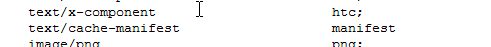

# H5 学习手册

[toc]

## H5 简介

H5 的设计目的是为了在移动设备上支持多媒体

## H5 中的新元素

H5 中新添加了 canvas 元素和一些多媒体，表单，语义与结构元素，废除了一些旧的元素

### `<canvas>` 新元素:

| 标签       | 描述                                                               |
| ---------- | ------------------------------------------------------------------ |
| `<canvas>` | 标签定义图形，比如图表和其他图像。该标签基于 JavaScript 的绘图 API |

### 新多媒体元素

| 标签       | 描述                                                           |
| ---------- | -------------------------------------------------------------- |
| `<audio> ` | 定义音频内容                                                   |
| `<video> ` | 定义视频（video 或者 movie）                                   |
| `<source>` | 定义多媒体资源 `<video>` 和 `<audio>`                          |
| `<embed> ` | 定义嵌入的内容，比如插件。                                     |
| `<track> ` | 为诸如 `<video>` 和 `<audio>` 元素之类的媒介规定外部文本轨道。 |

### 新表单元素

| 标签         | 描述                                                                 |
| ------------ | -------------------------------------------------------------------- |
| `<datalist>` | 定义选项列表。请与 input 元素配合使用该元素，来定义 input 可能的值。 |
| `<keygen>`   | 规定用于表单的密钥对生成器字段。                                     |
| `<output>`   | 定义不同类型的输出，比如脚本的输出。                                 |

### 新的语义和结构元素

HTML5 提供了新的元素来创建更好的页面结构：
|标签| 描述|
|-|-|
|`<article> `| 定义页面独立的内容区域。|
|`<aside>` | 定义页面的侧边栏内容。|
|`<bdi>` | 允许您设置一段文本，使其脱离其父元素的文本方向设置。|
|`<command>` | 定义命令按钮，比如单选按钮、复选框或按钮|
|`<details> `| 用于描述文档或文档某个部分的细节|
|`<dialog> `| 定义对话框，比如提示框|
|`<summary> `| 标签包含 details 元素的标题|
|`<figure>` | 规定独立的流内容（图像、图表、照片、代码等等）。|
|`<figcaption>` |定义 `<figure>` 元素的标题|
|`<footer> `|定义 section 或 document 的页脚。|
|`<header> `|定义了文档的头部区域|
|`<mark>` |定义带有记号的文本。|
|`<meter>` |定义度量衡。仅用于已知最大和最小值的度量。|
|`<nav>` |定义导航链接的部分。|
|`<progress> `| 定义任何类型的任务的进度。|
|`<ruby>` |定义 ruby 注释（中文注音或字符）。|
|`<rt>` |定义字符（中文注音或字符）的解释或发音。|
|`<rp> `|在 ruby 注释中使用，定义不支持 ruby 元素的浏览器所显示的内容。|
|`<section> `|定义文档中的节（section、区段）。|
|`<time> `|定义日期或时间。|
|`<wbr> `|规定在文本中的何处适合添加换行符。|

## canvas 元素

`<canvas>` 标签定义图形，比如图表和其他图像，您必须使用脚本来绘制图形。

详情见：<https://developer.mozilla.org/zh-CN/docs/Web/API/Canvas_API/Tutorial>

### 什么是 canvas?

HTML5 `<canvas>` 元素用于图形的绘制，通过脚本 (通常是 JavaScript)来完成.
`<canvas>` 标签只是图形容器，您必须使用脚本来绘制图形。
你可以通过多种方法使用 canvas 绘制路径,盒、圆、字符以及添加图像。

1. 创建一个画布（Canvas）
   一个画布在网页中是一个矩形框，通过 `<canvas>` 元素来绘制.
   **注意:** 默认情况下 `<canvas>` 元素没有边框和内容。

   `<canvas>`简单实例如下:
   **注意:** 标签通常需要指定一个 id 属性 (脚本中经常引用), width 和 height 属性定义的画的大小.

   **提示：** 你可以在 HTML 页面中使用多个 `<canvas>` 元素.

   ```html
   <canvas id="myCanvas" width="200" height="100"></canvas>
   ```

   使用 style 属性来添加边框:

   ```html
   <canvas
     id="myCanvas"
     width="200"
     height="100"
     style="border:1px solid #000000;"
   >
   </canvas>
   ```

2. 使用 JavaScript 来绘制图像
   canvas 元素本身是没有绘图能力的。所有的绘制工作必须在 JavaScript 内部完成：

   ```js
   var c = document.getElementById("myCanvas");
   var ctx = c.getContext("2d");
   ctx.fillStyle = "#FF0000";
   ctx.fillRect(0, 0, 150, 75);
   ```

   实例解析:

   1. 首先，找到 `<canvas>` 元素:

   ```js
   var c = document.getElementById("myCanvas");
   ```

   2. 然后，创建 context 对象：getContext("2d") 对象是内建的 HTML5 对象，拥有多种绘制路径、矩形、圆形、字符以及添加图像的方法。

   ```js
   var ctx = c.getContext("2d");
   ```

   3. 下面的两行代码绘制一个红色的矩形：

   ```js
   ctx.fillStyle = "#FF0000";
   ctx.fillRect(0, 0, 150, 75);
   ```

   设置 fillStyle 属性可以是 CSS 颜色，渐变，或图案。fillStyle 默认设置是#000000（黑色）。
   fillRect(x,y,width,height) 方法定义了矩形当前的填充方式。

- canvas 坐标
  canvas 是一个二维网格。
  canvas 的左上角坐标为 (0,0)。

  上面的 fillRect 方法拥有参数 (0,0,150,75)。
  意思是：在画布上绘制 150x75 的矩形，从左上角开始 (0,0)。

- Canvas - 路径
  在 Canvas 上画线，我们将使用以下两种方法：

  - moveTo(x,y) 定义线条开始坐标
  - lineTo(x,y) 定义线条结束坐标

  ```js
  var c = document.getElementById("myCanvas");
  var ctx = c.getContext("2d");
  ctx.moveTo(0, 0);
  ctx.lineTo(200, 100);
  ctx.stroke();
  ```

  

- Canvas - 文本
  使用 canvas 绘制文本，重要的属性和方法如下：

  - font - 定义字体
  - fillText(text,x,y) - 在 canvas 上绘制实心的文本
  - strokeText(text,x,y) - 在 canvas 上绘制空心的文本

  使用 fillText():

  ```js
  var c = document.getElementById("myCanvas");
  var ctx = c.getContext("2d");
  ctx.font = "30px Arial";
  ctx.fillText("Hello World", 10, 50);
  ```

  

- Canvas - 渐变
  渐变可以填充在矩形, 圆形, 线条, 文本等等, 各种形状可以自己定义不同的颜色。

  以下有两种不同的方式来设置 Canvas 渐变：

  - createLinearGradient(x,y,x1,y1) - 创建线条渐变
  - createRadialGradient(x,y,r,x1,y1,r1) - 创建一个径向/圆渐变
    当我们使用渐变对象，必须使用两种或两种以上的停止颜色。

  addColorStop()方法指定颜色停止，参数使用坐标来描述，可以是 0 至 1.

  使用渐变，设置 fillStyle 或 strokeStyle 的值为 渐变，然后绘制形状，如矩形，文本，或一条 线。

  使用 createLinearGradient():

  ```js
  var c = document.getElementById("myCanvas");
  var ctx = c.getContext("2d");

  // 创建渐变
  var grd = ctx.createLinearGradient(0, 0, 200, 0);
  grd.addColorStop(0, "red");
  grd.addColorStop(1, "white");

  // 填充渐变
  ctx.fillStyle = grd;
  ctx.fillRect(10, 10, 150, 80);
  ```

  

- Canvas - 图像
  把一幅图像放置到画布上, 使用以下方法:

  drawImage(image,x,y)

  ```js
  var c = document.getElementById("myCanvas");
  var ctx = c.getContext("2d");
  var img = document.getElementById("scream");
  ctx.drawImage(img, 10, 10);
  ```

  

## 内联 SVG

详情见：<https://developer.mozilla.org/zh-CN/docs/Web/SVG>

### 什么是 SVG？

- SVG 指可伸缩矢量图形 (Scalable Vector Graphics)
- SVG 用于定义用于网络的基于矢量的图形
- SVG 使用 XML 格式定义图形
- SVG 图像在放大或改变尺寸的情况下其图形质量不会有损失
- SVG 是万维网联盟的标准

### SVG 的优势

与其他图像格式相比（比如 JPEG 和 GIF），使用 SVG 的优势在于：

- SVG 图像可通过文本编辑器来创建和修改
- SVG 图像可被搜索、索引、脚本化或压缩
- SVG 是可伸缩的
- SVG 图像可在任何的分辨率下被高质量地打印
- SVG 可在图像质量不下降的情况下被放大

把 SVG 直接嵌入 HTML 页面

```html
<svg xmlns="http://www.w3.org/2000/svg" version="1.1" height="190">
  <polygon points="100,10 40,180 190,60 10,60 160,180"
  style="fill:lime;stroke:purple;stroke-width:5;fill-rule:evenodd;">
</svg>
```

### SVG 与 Canvas 两者间的区别

SVG 是一种使用 XML 描述 2D 图形的语言。

Canvas 通过 JavaScript 来绘制 2D 图形。

SVG 基于 XML，这意味着 SVG DOM 中的每个元素都是可用的。您可以为某个元素附加 JavaScript 事件处理器。

在 SVG 中，每个被绘制的图形均被视为对象。如果 SVG 对象的属性发生变化，那么浏览器能够自动重现图形。

Canvas 是逐像素进行渲染的。在 canvas 中，一旦图形被绘制完成，它就不会继续得到浏览器的关注。如果其位置发生变化，那么整个场景也需要重新绘制，包括任何或许已被图形覆盖的对象。

### Canvas 与 SVG 的比较

下表列出了 canvas 与 SVG 之间的一些不同之处。

|                       Canvas                       |                           SVG                           |
| :------------------------------------------------: | :-----------------------------------------------------: |
|                     依赖分辨率                     |                      不依赖分辨率                       |
|                  不支持事件处理器                  |                     支持事件处理器                      |
|                  弱的文本渲染能力                  |    最适合带有大型渲染区域的应用程序（比如谷歌地图）     |
|        能够以 .png 或 .jpg 格式保存结果图像        | 复杂度高会减慢渲染速度（任何过度使用 DOM 的应用都不快） |
| 最适合图像密集型的游戏，其中的许多对象会被频繁重绘 |                     不适合游戏应用                      |

## MathML

HTML5 可以在文档中使用 MathML 元素，对应的标签是 `<math>`...`</math>` 。

MathML 是数学标记语言，是一种基于 XML（标准通用标记语言的子集）的标准，用来在互联网上书写数学符号和公式的置标语言。

详情见：<https://developer.mozilla.org/zh-CN/docs/Web/MathML>

## 拖放（Drag 和 Drop）

拖放是一种常见的特性，即抓取对象以后拖到另一个位置。

在 HTML5 中，拖放是标准的一部分，任何元素都能够拖放。

详情见：<https://developer.mozilla.org/zh-CN/docs/Web/API/HTML_Drag_and_Drop_API>

1.  设置元素为可拖放（必需）
    让一个元素被拖拽**需要添加 draggable 属性为 true**，再加上全局**事件处理函数 ondragstart**。
    _提示：_ 链接和图片默认是可拖动的，不需要 draggable 属性。

    ```html
    <p id="p1" draggable="true">This element is draggable.</p>
    <script>
      function dragstart_handler(ev) {
        // Add the target element's id to the data transfer object
        ev.dataTransfer.setData("text/plain", ev.target.id);
      }
      const element = document.getElementById("p1");
      element.addEventListener("dragstart", dragstart_handler);
    </script>
    ```

2.  定义拖拽数据
    拖拽过程中，浏览器会在鼠标旁显示一张默认图片。当然，应用程序也可以通过 setDragImage() 方法自定义一张图片，

    ```js
    function dragstart_handler(ev) {
      var img = new Image();
      img.src = "example.gif";
      ev.dataTransfer.setDragImage(img, 10, 10);
    }
    ```

3.  定义一个放置区（必需）
    当拖拽一个项目到 HTML 元素中时，浏览器默认不会有任何响应。想要让一个元素变成可释放区域，该元素必须**设置 ondragover 和 ondrop 事件处理程序属性**。
    **_注意：_** 每个处理程序调用 preventDefault() 来阻止对这个事件的其它处理过程（如触点事件或指针事件）。
    ```html
    <p
      id="target"
      ondrop="drop_handler(event)"
      ondragover="dragover_handler(event) "
    >
      Drop Zone
    </p>
    <script>
      function dragover_handler(ev) {
        ev.preventDefault();
        ev.dataTransfer.dropEffect = "move";
      }
      function drop_handler(ev) {
        ev.preventDefault();
        // Get the id of the target and add the moved element to the target's DOM
        var data = ev.dataTransfer.getData("text/plain");
        ev.target.appendChild(document.getElementById(data));
      }
    </script>
    ```
4.  处理放置效果
    drop 事件的处理程序是以程序指定的方法处理拖拽数据。一般，程序调用 getData() 方法取出拖拽项目并按一定方式处理。程序意义根据 dropEffect 的值与/或可变更关键字的状态而不同
    ```html
    <p id="p1" draggable="true" ondragstart="dragstart_handler(event)">
      This element is draggable.
    </p>
    <div
      id="target"
      ondrop="drop_handler(event)"
      ondragover="dragover_handler(event)   "
    >
      Drop Zone
    </div>
    <script>
      function dragstart_handler(ev) {
        // Add the target element's id to the data transfer object
        ev.dataTransfer.setData("application/my-app", ev.target.id);
        ev.dataTransfer.dropEffect = "move";
      }
      function dragover_handler(ev) {
        ev.preventDefault();
        ev.dataTransfer.dropEffect = "move";
      }
      function drop_handler(ev) {
        ev.preventDefault();
        // Get the id of the target and add the moved element to the target's DOM
        var data = ev.dataTransfer.getData("application/my-app");
        ev.target.appendChild(document.getElementById(data));
      }
    </script>
    ```
5.  拖拽结束
    拖拽操作结束时，在源元素（开始拖拽时的目标元素）上触发 dragend 事件。不管拖拽是完成还是被取消这个事件都会被触发。dragend 事件处理程序可以检查 dropEffect 属性的值来确认拖拽成功与否。

## 地理定位（Geolocation）

HTML5 Geolocation API 用于获得用户的地理位置。

鉴于该特性可能侵犯用户的隐私，除非用户同意，否则用户位置信息是不可用的。

详情见：<https://developer.mozilla.org/zh-CN/docs/Web/API/Geolocation>

## 视频（Video）与音频（Audio）

标签之间插入的内容是提供给不支持 video 元素的浏览器显示的。

支持多个 `<source>` 元素. `<source>` 元素可以链接不同的视频文件。浏览器将使用第一个可识别的格式:当前支持三种视频格式： MP4/MP3, WebM/Wav, 和 Ogg。

视频实例如下：

```html
<video width="320" height="240" controls>
  <source src="movie.mp4" type="video/mp4" />
  <source src="movie.ogg" type="video/ogg" />
  您的浏览器不支持Video标签。
</video>
```

音频实例如下：

```html
<audio controls>
  <source src="horse.ogg" type="audio/ogg" />
  <source src="horse.mp3" type="audio/mpeg" />
  您的浏览器不支持 audio 元素。
</audio>
```

HTML5 `<video>` 和 `<audio>` 元素同样拥有方法、属性和事件。

`<video>` 和 `<audio>`元素的方法、属性和事件可以使用 JavaScript 进行控制.

其中的方法用于播放、暂停以及加载等。其中的属性（比如时长、音量等）可以被读取或设置。其中的 DOM 事件能够通知您，比方说，`<video>` 元素开始播放、已暂停，已停止，等等。

- HTML5 Video 标签
  |标签 |描述|
  |-|-|
  |`<video>` |定义一个视频|
  |`<source>` |规定了多媒体资源, 可以是多个，在 `<video>` 与 `<audio>`标签中使用|
  |`<track> `|定义在媒体播放器文本轨迹|

- HTML5 Audio 标签
  |标签 |描述|
  |-|-|
  |`<audio>` | 定义了声音内容|
  |`<source>` |规定了多媒体资源, 可以是多个，在 `<video>` 与 `<audio>`标签中使用|

## HTML5 新的 Input 类型

HTML5 拥有多个新的表单输入类型。这些新特性提供了更好的输入控制和验证。
|类型（type）|功能|
|-|-|
|color|用在 input 字段主要用于选取颜色|
|date|允许你从一个日期选择器选择一个日期|
|datetime|允许你选择一个日期（UTC 时间）|
|datetime-local|允许你选择一个日期和时间 (无时区)|
|email|用于应该包含 e-mail 地址的输入域|
|month|允许你选择一个月份|
|number|用于应该包含数值的输入域|
|range|用于应该包含一定范围内数字值的输入域（显示为滑动条）|
|search|用于搜索域，比如站点搜索或 Google 搜索|
|tel|定义输入电话号码字段|
|time|允许你选择一个时间|
|url|用于应该包含 URL 地址的输入域。在提交表单时，会自动验证 url 域的值|
|week|允许你选择周和年|

## 表单

### HTML5 新表单元素

| 标签         | 描述                                                                              |
| ------------ | --------------------------------------------------------------------------------- |
| `<datalist>` | `<input>`标签定义选项列表。请与 input 元素配合使用该元素，来定义 input 可能的值。 |
| `<keygen>`   | `<keygen>` 标签规定用于表单的密钥对生成器字段。                                   |
| `<output>`   | `<output>` 标签定义不同类型的输出，比如脚本的输出。                               |

### HTML5 新的表单属性

- `<form>`新属性：

| 属性         | 描述                                                                                                          |
| ------------ | ------------------------------------------------------------------------------------------------------------- |
| autocomplete | 规定 form 或 input 域应该拥有自动完成功能。当用户在自动完成域中开始输入时，浏览器应该在该域中显示填写的选项。 |
| novalidate   | novalidate 属性是一个 boolean(布尔) 属性，规定在提交表单时不应该验证 form 或 input 域。                       |

- `<input>`新属性：

| 属性            | 描述                                                                                                                                                                                                                                           |
| --------------- | ---------------------------------------------------------------------------------------------------------------------------------------------------------------------------------------------------------------------------------------------- |
| autocomplete    | 规定 form 或 input 域应该拥有自动完成功能。当用户在自动完成域中开始输入时，浏览器应该在该域中显示填写的选项。                                                                                                                                  |
| autofocus       | 是一个 boolean 属性,规定在页面加载时，域自动地获得焦点。                                                                                                                                                                                       |
| form            | 规定输入域所属的一个或多个表单。**提示:** 如需引用一个以上的表单，请使用空格分隔的列表。                                                                                                                                                       |
| formaction      | 用于描述表单提交的 URL 地址,会覆盖`<form>` 元素中的 action 属性                                                                                                                                                                                |
| formenctype     | 描述了表单提交到服务器的数据编码 (只对 form 表单中 method="post" 表单)会覆盖 form 元素的 enctype 属性。**注意:** 该属性与 type="submit" 和 type="image" 配合使用。                                                                             |
| formmethod      | 定义了表单提交的方式。会覆盖了 `<form>` 元素的 method 属性。**注意:** 该属性可以与 type="submit" 和 type="image" 配合使用                                                                                                                      |
| formnovalidate  | 会覆盖 `<form>` 元素的 novalidate 属性.**注意:** formnovalidate 属性与 type="submit 一起使用                                                                                                                                                   |
| formtarget      | 指定一个名称或一个关键字来指明表单提交数据接收后的展示会覆盖 `<form>`元素的 target 属性.**注意:** formtarget 属性与 type="submit" 和 type="image"配合使用.                                                                                     |
| height 与 width | height 和 width 属性规定用于 image 类型的 `<input>` 标签的图像高度和宽度。**注意:** height 和 width 属性只适用于 image 类型的`<input>` 标签。                                                                                                  |
| list            | 规定输入域的 datalist。datalist 是输入域的选项列表。                                                                                                                                                                                           |
| min 与 max      | min、max 和 step 属性用于为包含数字或日期的 input 类型规定限定（约束）。**注意:** min、max 和 step 属性适用于以下类型的 `<input>` 标签：date pickers、number 以及 range。                                                                      |
| multiple        | 是一个 boolean 属性。multiple 属性规定`<input>` 元素中可选择多个值。**注意:** multiple 属性适用于以下类型的 `<input>` 标签：email 和 file                                                                                                      |
| pattern         | 描述了一个正则表达式用于验证 `<input>` 元素的值。**注意:** pattern 属性适用于以下类型的 `<input>` 标签: text, search, url, tel, email, 和 password                                                                                             |
| placeholder     | 提供一种提示（hint），描述输入域所期待的值。简短的提示在用户输入值前会显示在输入域上。**注意:** placeholder 属性适用于以下类型的 `<input>` 标签：text, search, url, telephone, email 以及 password。                                           |
| required        | 是一个 boolean 属性，规定必须在提交之前填写输入域（不能为空）。**注意:** required 属性适用于以下类型的 `<input>` 标签：text, search, url, telephone, email, password, date pickers, number, checkbox, radio 以及 file。                        |
| step            | 为输入域规定合法的数字间隔。如果 step="3"，则合法的数是 -3,0,3,6 等。_提示：_ step 属性可以与 max 和 min 属性创建一个区域值。**注意:** step 属性与以下 type 类型一起使用: number, range, date, datetime, datetime-local, month, time 和 week。 |

## HTML5 新增的语义元素

- `<header>`：描述了文档的头部区域，主要用于定义内容的介绍展示区域.在页面中你可以使用多个`<header>` 元素.
- `<nav>`：用于定义页面的导航链接部分区域，但是，不是所有的链接都需要包含在 `<nav>` 元素中!
- `<section>`：定义文档中的节（section、区段）。比如章节、页眉、页脚或文档中的其他部分。
- `<article>`：定义独立的内容。比如：论坛文章，博客文章，新闻报道，评论区等。
- `<aside>`：定义页面主区域内容之外的内容（比如侧边栏）。aside 标签的内容应与主区域的内容相关.
- `<figcaption>`：定义 `<figure>` 元素的标题,`<figcaption>`元素应该被置于 "figure" 元素的第一个或最后一个子元素的位置。
- `<figure>`：规定独立的流内容（图像、图表、照片、代码等等）。`<figure>` 元素的内容应该与主内容相关，但如果被删除，则不应对文档流产生影响。
- `<footer>`：文档的底部区域，`<footer>` 元素应该包含它的包含元素，一个页脚通常包含文档的作者，著作权信息，链接的使用条款，联系信息等。文档中你可以使用多个 `<footer>`元素.
  

## Web 储存

存储对象是简单的键值存储，类似于对象，但是它们在页面加载时保持完整。键和值始终是字符串（请注意，与对象一样，整数键将自动转换为字符串）。您可以像访问对象一样访问这些值，或者使用 Storage.getItem() 和 Storage.setItem() 方法 。这三行都设置了（相同的）colorSetting 条目：

```js
localStorage.colorSetting = "#a4509b";
localStorage["colorSetting"] = "#a4509b";
localStorage.setItem("colorSetting", "#a4509b");
```

Web Storage 包含如下两种机制：

- sessionStorage 为每一个给定的源（given origin）维持一个独立的存储区域，该存储 域在页面会话期间可用（即只要浏览器处于打开状态，包括页面重新加载和恢复）。
- localStorage 同样的功能，但是在浏览器关闭，然后重新打开后数据仍然存在。

不管是 localStorage，还是 sessionStorage，可使用的 API 都相同，常用的有如下几个（以 localStorage 为例）：

- 保存数据：localStorage.setItem(key,value);
- 读取数据：localStorage.getItem(key);
- 删除单个数据：localStorage.removeItem(key);
- 删除所有数据：localStorage.clear();
- 得到某个索引的 key：localStorage.key(index);

## Web SQL(待定——貌似被废除了)

## 应用程序缓存

### 什么是应用程序缓存（Application Cache）？

HTML5 引入了应用程序缓存，这意味着 web 应用可进行缓存，并可在没有因特网连接时进行访问。

应用程序缓存为应用带来三个优势：

- 1.离线浏览 - 用户可在应用离线时使用它们
- 2.速度 - 已缓存资源加载得更快
- 3.减少服务器负载 - 浏览器将只从服务器下载更新过或更改过的资源。

### 离线缓存这个功能的实现有以下步骤：

1. 以 nginx 做 web 服务器为例，在 mime.types 文件中添加一行：text/cache-manifest manifest,作用是为了让服务器识别该类型文件。
   
2. 在 html 文件 html 标签中添加一行 manifest="cache.appcache",告诉浏览器要加载的内容。
   
3. 在该目录下新建一个文件 cache.appcache，文件内容为：
   

   chche manifest 为版本号：

   chche 是告诉浏览器要缓存的文件：

   network 是指定不会缓存的文件，这里的\*号表示所有其他文件都需要因特网连接

   fallback:是如果无法建立因特网连接时加载的页面

完成后便可以执行一下，会发现浏览器已经加载了相应的文件在本地上，断开网络，这些文件依然可以访问。

### 更新缓存

一旦应用被缓存，它就会保持缓存直到发生下列情况：

- 用户清空浏览器缓存
- manifest 文件被修改（参阅下面的提示）
- 由程序来更新应用缓存

_提示:_ 以 "#" 开头的是注释行，但也可满足其他用途。应用的缓存会在其 manifest 文件更改时被更新。如果您编辑了一幅图片，或者修改了一个 JavaScript 函数，这些改变都不会被重新缓存。更新注释行中的日期和版本号是一种使浏览器重新缓存文件的办法。

关于应用程序缓存的说明
请留心缓存的内容。

一旦文件被缓存，则浏览器会继续展示已缓存的版本，即使您修改了服务器上的文件。为了确保浏览器更新缓存，您需要更新 manifest 文件。

**注意:** 浏览器对缓存数据的容量限制可能不太一样（某些浏览器设置的限制是每个站点 5MB）。

## Web Worker

基本用法:

1. 主线程采用 new 命令，调用 Worker()构造函数，新建一个 Worker 线程。

   ```js
   var worker = new Worker("work.js");
   ```

   `Worker()`构造函数的参数是一个脚本文件，该文件就是 Worker 线程所要执行的任务。由于 Worker 不能读取本地文件，所以这个脚本必须来自网络。如果下载没有成功（比如 404 错误），Worker 就会默默地失败。

2. 然后，主线程调用 worker.postMessage()方法，向 Worker 发消息。

   ```js
   worker.postMessage("Hello World");
   worker.postMessage({ method: "echo", args: ["Work"] });
   ```

   `worker.postMessage()`方法的参数，就是主线程传给 Worker 的数据。它可以是各种数据类型，包括二进制数据。

3. 接着，主线程通过 worker.onmessage 指定监听函数，接收子线程发回来的消息。

   ```js
   worker.onmessage = function (event) {
     console.log("Received message " + event.data);
     //doSomething;
   };
   ```

   事件对象的 data 属性可以获取 Worker 发来的数据。

4. Worker 线程内部需要有一个监听函数，监听 message 事件。

   ```js
   self.addEventListener("message", function (e) {
     self.postMessage("You said: " + e.data);
   });
   ```

   `self`代表子线程自身，即子线程的全局对象。因此，等同于下面两种写法。

   ```js
   // 写法一
   this.addEventListener("message", function (e) {
     this.postMessage("You said: " + e.data);
   });

   // 写法二
   addEventListener("message", function (e) {
     postMessage("You said: " + e.data);
   });
   ```

   除了使用 self.addEventListener()指定监听函数，也可以使用 self.onmessage 指定。监听函数的参数是一个事件对象，它的 data 属性包含主线程发来的数据。self.postMessage()方法用来向主线程发送消息。

   根据主线程发来的数据，Worker 线程可以调用不同的方法，下面是一个例子。

   ```js
   self.addEventListener("message", function (e) {
     var data = e.data;
     switch (data.cmd) {
       case "start":
         self.postMessage("WORKER STARTED: " + data.msg);
         break;
       case "stop":
         self.postMessage("WORKER STOPPED: " + data.msg);
         self.close(); // Terminates the worker.
         break;
       default:
         self.postMessage("Unknown command: " + data.msg);
     }
   });
   ```

5. Worker 完成任务以后，主线程就可以把它关掉（或者 worker 线程自己关闭）。

   ```js
   worker.terminate();
   ```

   `self.close()`用于在 Worker 内部关闭自身。

主线程： Worker()构造函数返回一个 Worker 线程对象，用来供主线程操作 Worker。Worker 线程对象的属性和方法如下。

- `Worker.onerror`：指定 error 事件的监听函数。
- `Worker.onmessage`：指定 message 事件的监听函数，发送过来的数据在 Event.data 属性中。
- `Worker.onmessageerror`：指定 messageerror 事件的监听函数。发送的数据无法序列化成字符串时，会触发这个事件。
- `Worker.postMessage()`：向 Worker 线程发送消息。
- `Worker.terminate()`：立即终止 Worker 线程。

worker 线程：Web Worker 有自己的全局对象，不是主线程的 window，而是一个专门为 Worker 定制的全局对象。因此定义在 window 上面的对象和方法不是全部都可以使用。Worker 线程有一些自己的全局属性和方法。

- `self.name`： Worker 的名字。该属性只读，由构造函数指定。
- `self.onmessage`：指定 message 事件的监听函数。
- `self.onmessageerror`：指定 messageerror 事件的监听函数。发送的数据无法序列化成字符串时，会触发这个事件。
- `self.close()`：关闭 Worker 线程。
- `self.postMessage()`：向产生这个 Worker 线程发送消息。
- `self.importScripts()`：加载 JS 脚本。

## 服务器发送事件(Server-Sent Events)

HTML5 服务器发送事件（server-sent event）允许网页获得来自服务器的更新。
EventSource 对象用于接收服务器发送事件通知：
实例：

```js
var source = new EventSource("demo_sse.php");
source.onmessage = function (event) {
  document.getElementById("result").innerHTML += event.data + "<br>";
};
```

实例解析：

- 创建一个新的 EventSource 对象，然后规定发送更新的页面的 URL（本例中是 "demo_sse.php"）
- 每接收到一次更新，就会发生 onmessage 事件
- 当 onmessage 事件发生时，把已接收的数据推入 id 为 "result" 的元素中

EventSource 对象的事件：

- onopen：当通往服务器的连接被打开。
- onmessage ：当接收到消息。
- onerror：当发生错误。

## WebSocket

WebSocket 是 HTML5 开始提供的一种在单个 TCP 连接上进行全双工通讯的协议。

WebSocket 使得客户端和服务器之间的数据交换变得更加简单，允许服务端主动向客户端推送数据。

在 WebSocket API 中，浏览器和服务器只需要做一个握手的动作，然后，浏览器和服务器之间就形成了一条快速通道。两者之间就直接可以数据互相传送。并且这个连接会持续存在直到客户端或者服务器端的某一方主动的关闭连接。

创建 WebSocket 对象：

```js
var Socket = new WebSocket(url, [protocol]);
```

以上代码中的第一个参数 url, 指定连接的 URL。第二个参数 protocol 是可选的，指定了可接受的子协议。

- WebSocket 属性
  

- WebSocket 事件
  

- WebSocket 方法
  
