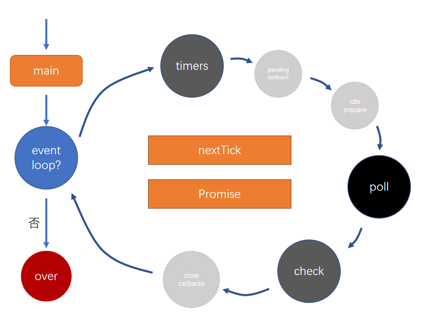

# NodeJS学习笔记 {ignore}

[toc]
## 前言
NodeJS的作者说，他创造NodeJS的目的是为了实现**高性能Web服务器**，他首先看重的是**事件机制**和**异步IO模型的优越性**，而不是JS。但是他需要选择一种编程语言实现他的想法，这种编程语言不能自带IO功能，并且需要能良好支持事件机制。

JS没有自带IO功能，天生就用于处理浏览器中的DOM事件，并且拥有一大群程序员，因此就成为了天然的选择。

## NodeJS基础
- NodeJS是一个JS脚本解析器，任何操作系统下安装NodeJS本质上做的事情都是把NodeJS执行程序复制到一个目录，然后保证这个目录在系统PATH环境变量下，以便终端下可以使用node命令。

- 终端下直接输入node命令可进入命令交互模式，很适合用来测试一些JS代码片段，比如正则表达式。

- NodeJS使用<u>CMD</u>模块系统，主模块作为程序入口点，所有模块在执行过程中只初始化一次。

- 除非JS模块不能满足需求，否则不要轻易使用二进制模块，否则你的用户会叫苦连天。

## node生命周期

